

# 📕 목차 
## 1. [**서비스 소개**](#1)
## 2. [**기술 스택**](#2)
## 3. [**시스템 아키텍처**](#3)
## 4. [**주요 기능**](#4)
## 5. [**팀원 소개**](#5)
## 6. [**설계 문서**](#6)

 
 
 

# 🔍 서비스 소개

## 당신의 카페인과 당 섭취를 줄여줄 인생 콰당 방지 서비스  
> 대한민국은 커피 공화국..!!  
전세계 1인당 연간 커피 소비량인 161잔을 훨씬 뛰어넘는 연간 367잔의 커피를 마시는 한국인들   
이 과정에서 무심코 섭취하게되는 카페인과 당을 관리하지 않는다면    
매일 무의식적으로 마시는 커피와 음료가 당신의 건강을 위협할 수 있습니다.  
따라서 이들을 관리해 줄 장치가 필요하지만, 그게 말처럼 쉽지많은 않습니다.
>
#### 콰당과 함께 지금 부터 카페인과 당 섭취를 관리해보세요

 
 
 

# 💻 기술 스택

## Front-end
- HTML5
- CSS3
- JavaScript
- VUE
- Pinia
- VSCODE
- WebRTC
 
 

## Back-end
- Java
- Spring
- JPA
- QueryDSL
- Gradle
- MYSQL
- Flask
- WebRTC
- Intellij
 
 

## Server
- AWS EC2
 
 

## Cooperation tool
- Jira
- GitLab
- Gerrit
- Notion
- Mattermost

 
 

 
 
 

# 🧮 시스템 아키텍처

 
 
 

# 🙌 주요 기능
 
 

## ❤ 시작페이지
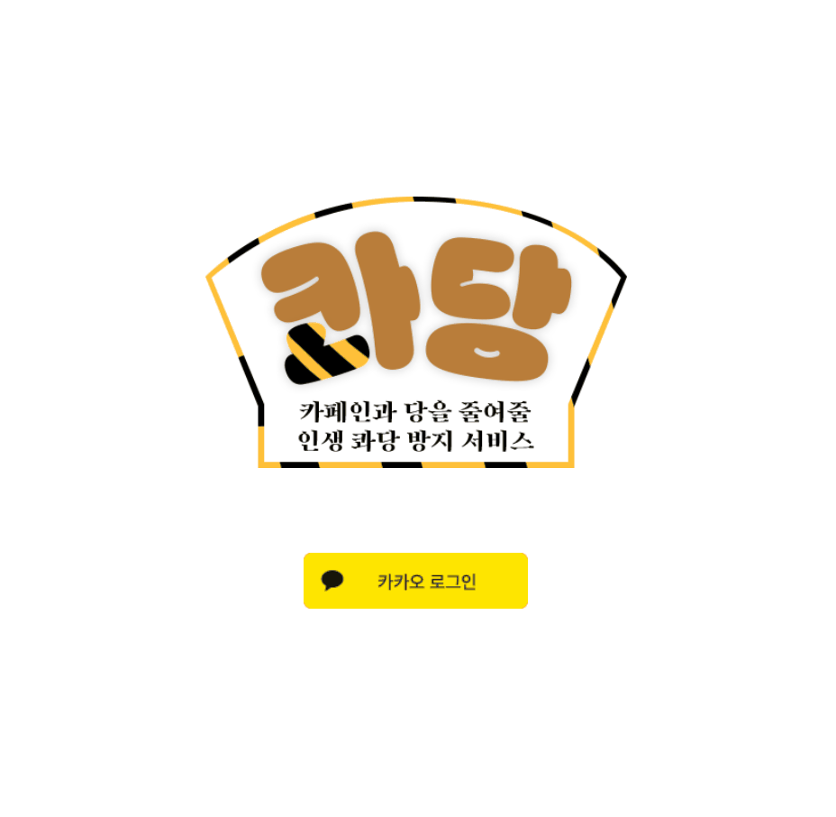
 
 

- 카카오 소셜로그인으로 회원가입 및 로그인이 가능합니다
 
 
 

## 🤝 회원가입페이지
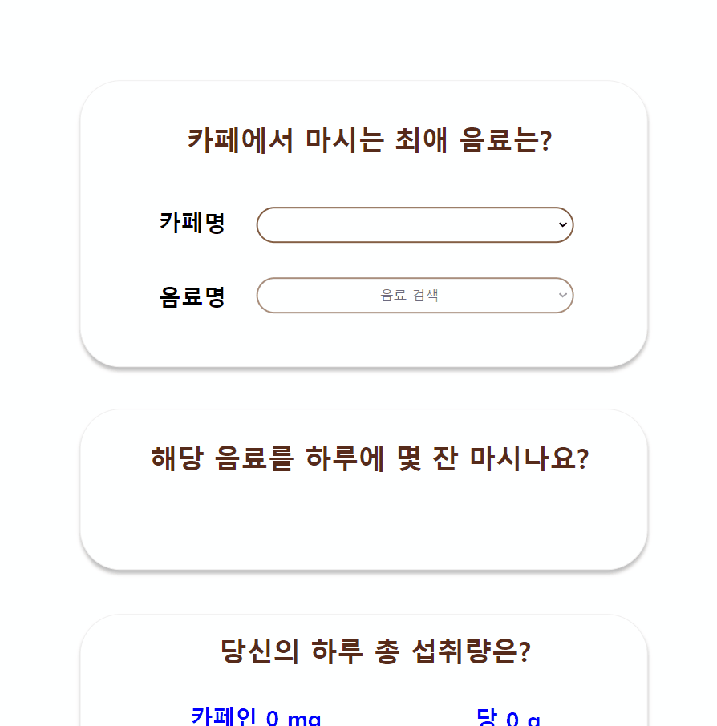

 

- 자주 마시는 음료를 기입하고 기입한 정보를 토대로 현재 상태를 간단하게 보여줍니다
- 설문조사는 건너뛰기도 가능합니다
- 완료되면 메인페이지로 넘어가게 됩니다
 
 
 

## 🌏 메인페이지
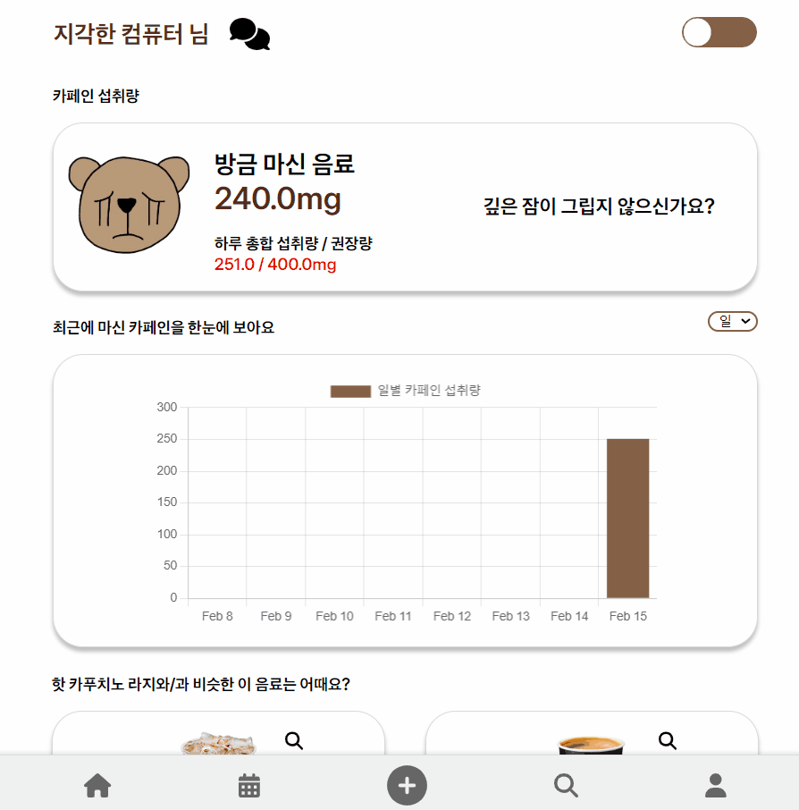

 

- 카페인, 당 권장 섭취량과 현재 섭취량을 비교해줍니다.  
- 일,주 별로 섭취량 현황을 알 수 있습니다
- 유저가 자주마신 음료를 기반으로 비슷한 음료를 추천해줍니다  
 
 
 

## ✍ 마신 음료 등록
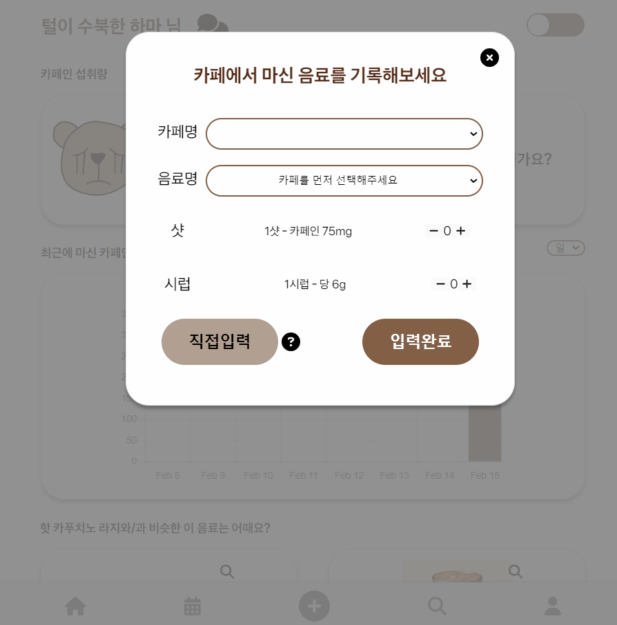
 
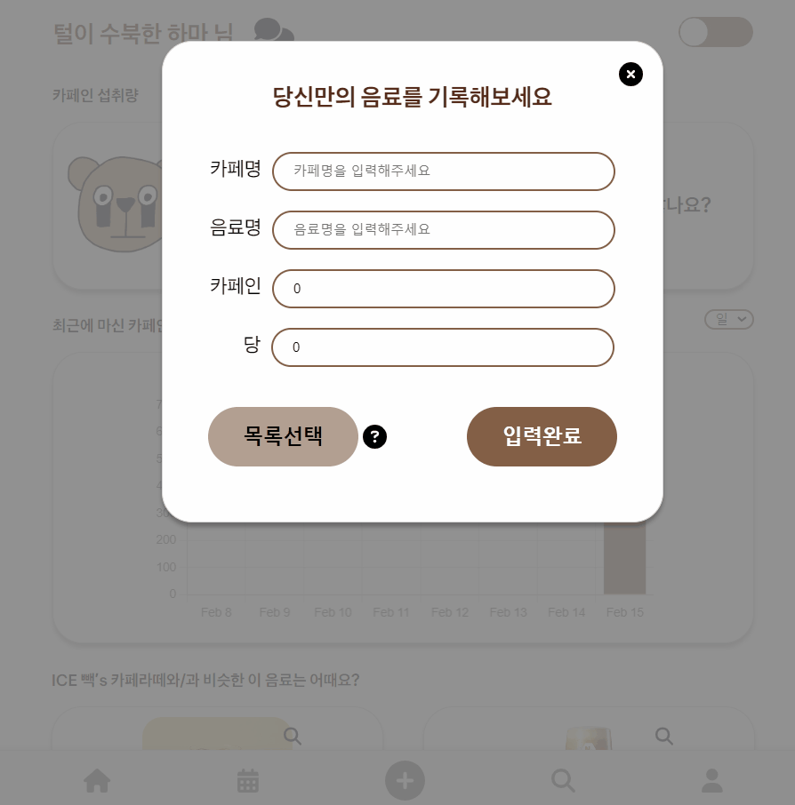

 

- 상위 15개의 프랜차이즈 카페에서 판매하는 커피 및 음료가 데이터베이스에 등록되어있습니다
- 샷, 시럽 추가 기입도 가능합니다
- 등록되어 있지 않은 나만의 음료도 직접 기입할 수 있습니다
 
 
 

## 🗣 채팅
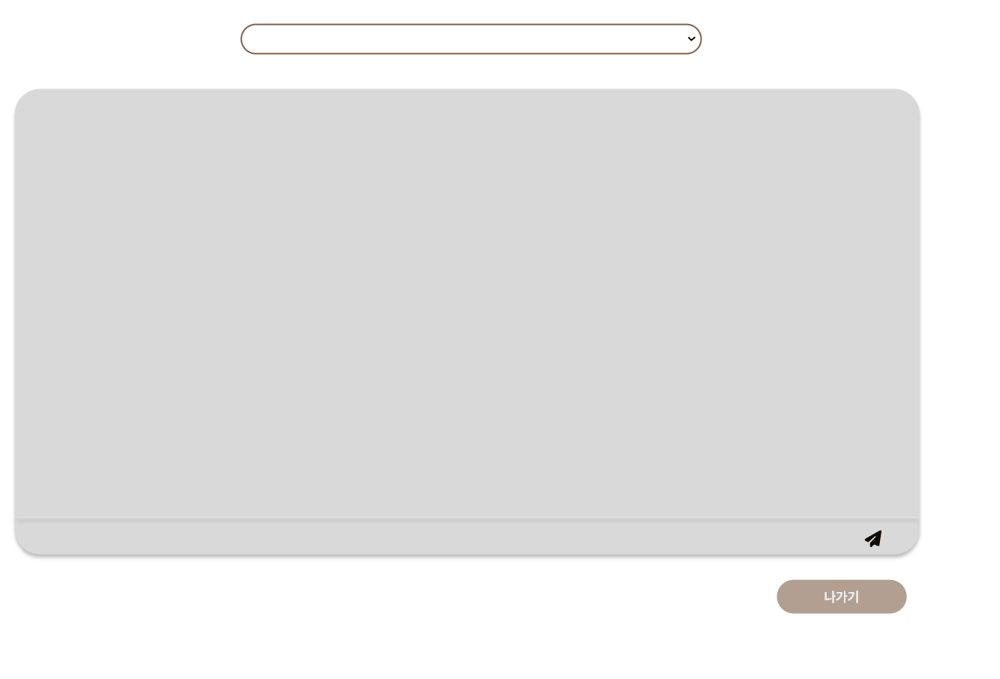

 

- 상위 15개 카페별로 채팅방이 열려있어 자유롭게 대화 가능합니다
 
 
 

## 📅 캘린더
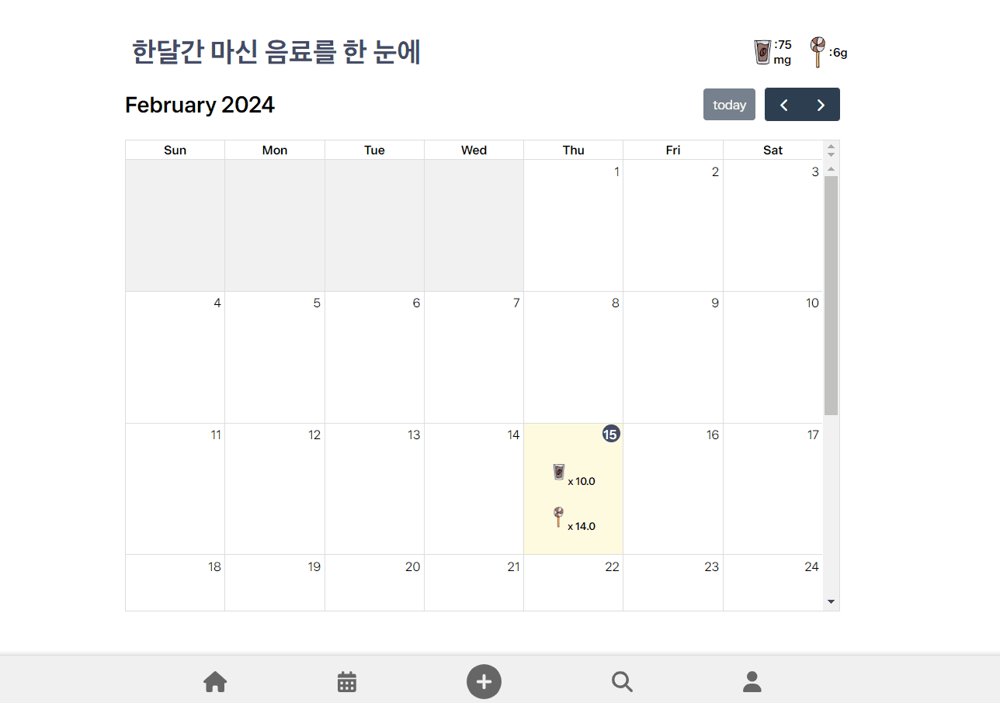

 

- 캘린더를 활용해 카페인과 당 섭취량을 한눈에 확인할 수 있습니다
- 해당일을 클릭하면 그날 마신 음료 정보를 알 수 있습니다
- 오늘 마신 음료는 수정 가능합니다
- 캘린더 상단에 권장 섭취량과 오늘 마신 수치를 비교해서 글씨의 색으로 나타내줍니다
 
 
 

## 🔎 검색페이지
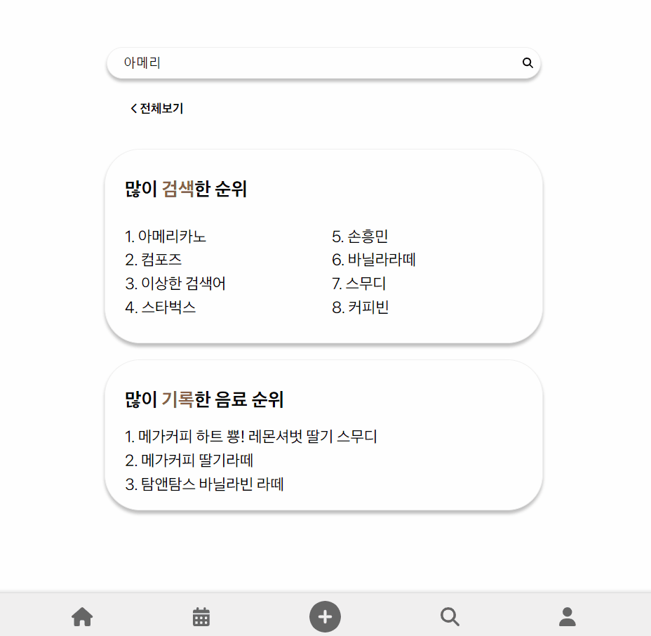
 

- 순위보기를 통해 검색순위와 인기 등록 음료 순위를 확인할 수 있습니다
- 전체보기를 통해 원하는 정렬방식대로 전체 음료를 확인할 수 있습니다
- 음료 상세보기가 가능합니다
- 음료들을 비교하여 여러 음료들을 한번에 확인할 수 있습니다 
 
 
 

## 👀 마이페이지/정보수정
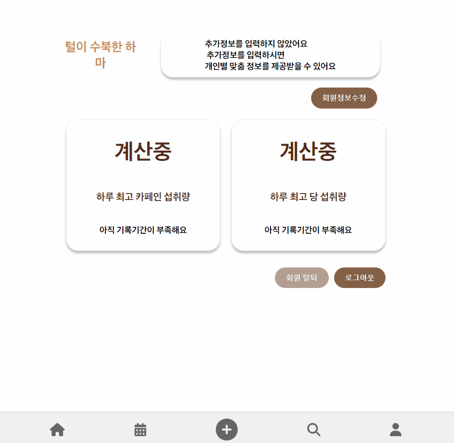
 

- 본인의 정보(키,몸무게,성별,나이)에 알맞은 섭취 권장량을 보여줍니다  
- 일별 최고 섭취량을 확인 할 수 있습니다  
- 정보수정이 가능합니다  
 
 
 
 

# 👫 팀원 소개 및 프로젝트 기간

<table>
    <tr>
        <td height="140px" align="center"> 
                👑 임지현  (Front-End) </a>  </td>
        <td height="140px" align="center"> 
                🙂 김준섭  (Front-End) </a>  </td>
        <td height="140px" align="center"> 
                😆 권근열  (Front-End) </a>  </td>
        <td height="140px" align="center"> 
                😁 김보경  (Back-End) </a>  </td>
        <td height="140px" align="center"> 
                🙄 김보라  (Back-End) </a>  </td>        
    </tr>
    <tr>
        <td align="center">UI/UX Vue </td>
        <td align="center">UI/UX Vue WebRTC,WebSocket</td>
        <td align="center">UI/UX Vue</td>
        <td align="center">REST API Spring Boot/Flask WebRTC,WebSocket Infra</td>
        <td align="center">REST API Spring Boot Infra</td>        
    </tr>
</table>

### 👫 똑똑이들 : 24.1.2 ~ 24.2.16

 
 
 

# 📃 설계 문서

## ERD
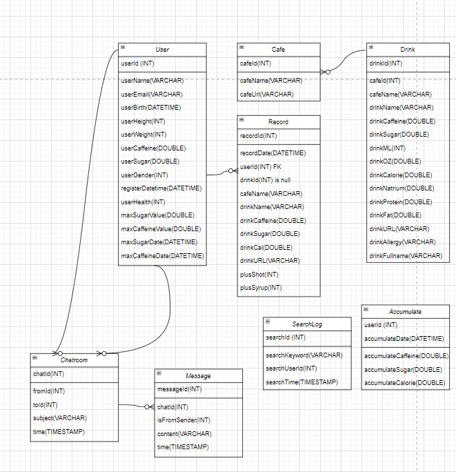

 
 
 

## 화면설계서

 
 
 

## 유저스토리

### 👉🏻[유저스토리 노션페이지](https://www.notion.so/whfflekwlqdprkrhtlvdjzzzz10/1697f15eb9d549b6affbc9b14c93f278)

 
 
 

## Commit convention

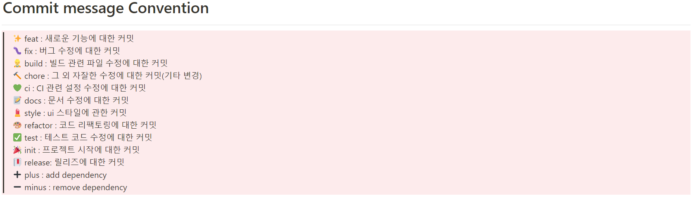

 
 
 

